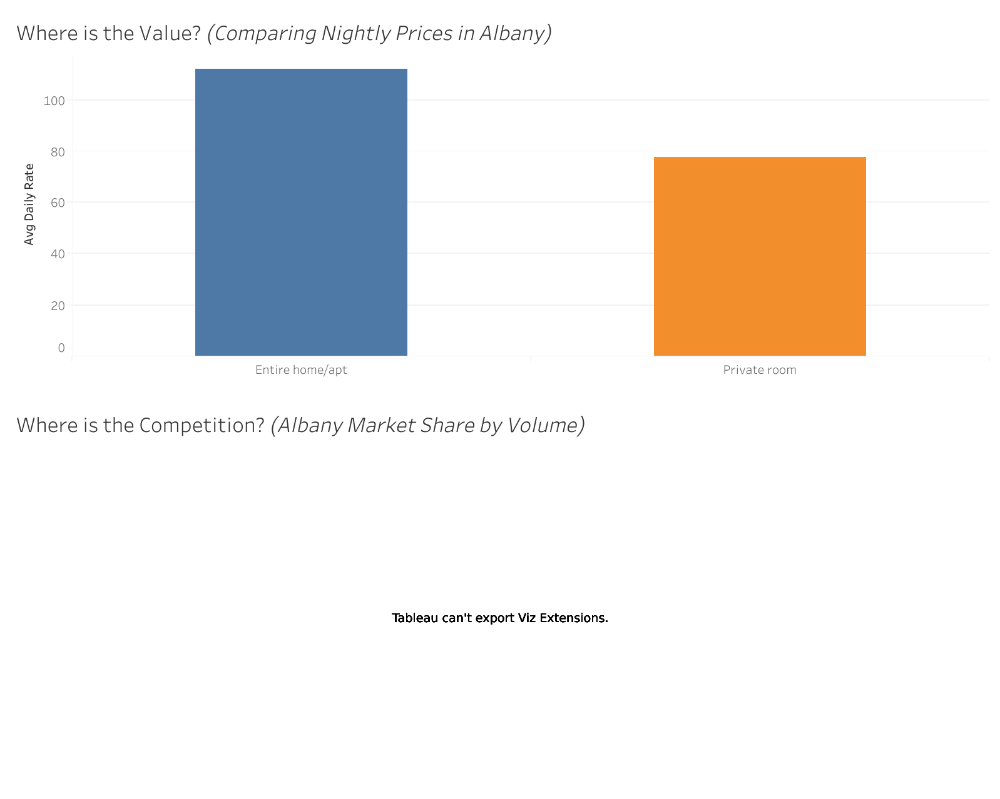

**Albany Airbnb Strategy: Where to Invest?**

**Introduction**

This repository contains a comprehensive market intelligence study of the Albany, New York Airbnb landscape for 2025. The goal of this project is to provide a data-driven roadmap for real estate investors by identifying "Market Gaps" where high revenue potential meets sustainable competition levels.

**Project Overview**

As the short-term rental market grows, investors face the risk of entering "oversupplied" segments that lead to price wars. This analysis evaluates 11 months of historical data to determine which property types offer the highest Average Daily Rate (ADR) and the most stable ROI for new acquisitions.



**Tools Used**

Data Cleaning: SQL (BigQuery)
Analysis: SQL (BigQuery)
Visualization: Tableau
Documentation: GitHub

**Data Source**

[Link to Inside Airbnb Albany Dataset](https://insideairbnb.com/get-the-data/)

**The Data Analysis Process**

1. Ask

Business Task: Perform a Market Supply & Value Analysis to identify the most lucrative room type for new real estate investments in Albany, NY.

Key Stakeholders: The Investment Committee, Asset Management Team, and Property Managers.

2. Prepare

Data Source: 11 monthly CSV files (Jan 2025 – Nov 2025) sourced from Inside Airbnb.

Organization: Each row represents a unique listing with details on price, room type, and location.

ROCCC Check: Data is Reliable, Original, Comprehensive, Current (Nov 2025), and Cited.

Known Limitations: Analysis accounts for advertised prices and active listings; it does not include "off-platform" bookings or occupancy-rate verification.

3. Process

Data Consolidation: I merged 11 individual monthly datasets into a single master table using UNION ALL. This allowed me to analyze the market's performance across nearly the entire year rather than relying on a single month's "snapshot."

Handling Load Errors: During the BigQuery import, I configured the load job to allow a minimal error threshold (skipping <0.5% of rows). This bypassed minor formatting issues in text fields without affecting the statistical integrity of the price or supply metrics.

Filtering "Price Noise": Raw data showed prices as high as $1,486, which would skew the "average" investor's expectations. I performed a 95th Percentile Analysis and discovered that 95% of the market operates at or below **$250**. To provide a realistic ROI projection, I "trimmed" the data to focus on the $50–$250 investable market.

***Sample Cleaning and Transformation Query***

```sql

--Consolidating 11 months of data
CREATE TABLE `albany_airbnb.albany_2025` AS
SELECT * FROM `albany_airbnb.jan`
UNION ALL SELECT * FROM `albany_airbnb.feb` --...continued for all months

--Getting the 95th percentile
SELECT
PERCENTILE_CONT(price, 0.95) OVER() AS p95_price
FROM `case-study-2025-483513.albany_airbnb.albany_2025` 
LIMIT 1

```

4. Analyze

The Privacy Premium: While "Entire home/apt" listings make up 77.4% of the market, they command a significant nightly premium.

The Value Gap: Entire units earn an average of $110/night, whereas private rooms are capped at $77/night, resulting to a 43% "Privacy Bonus."

Market Stability: The price gap remained consistent across all 11 months, proving that traveler demand for privacy is a structural market trend, not a seasonal fluke.

5. Share

[View my Tableau Public Viz](https://public.tableau.com/app/profile/arrenz.gorgonia/viz/AlbanyAirbnbStrategy-WheretoInvest/Dashboard1)

6. Act

Top 3 Recommendations:

Prioritize "Whole Unit" Acquisitions: Focus on studios or small homes that can be listed as "Entire Units" to secure the $110+ ADR floor.

Market for Privacy: Emphasize "no shared spaces" in marketing materials. This single feature accounts for a 43% price increase over shared-living options.

Target the Premium-Mid Tier: Position properties in the $150–$200 range. This sits comfortably above the market average but safely below the $250 luxury ceiling, maximizing both occupancy and profit.
